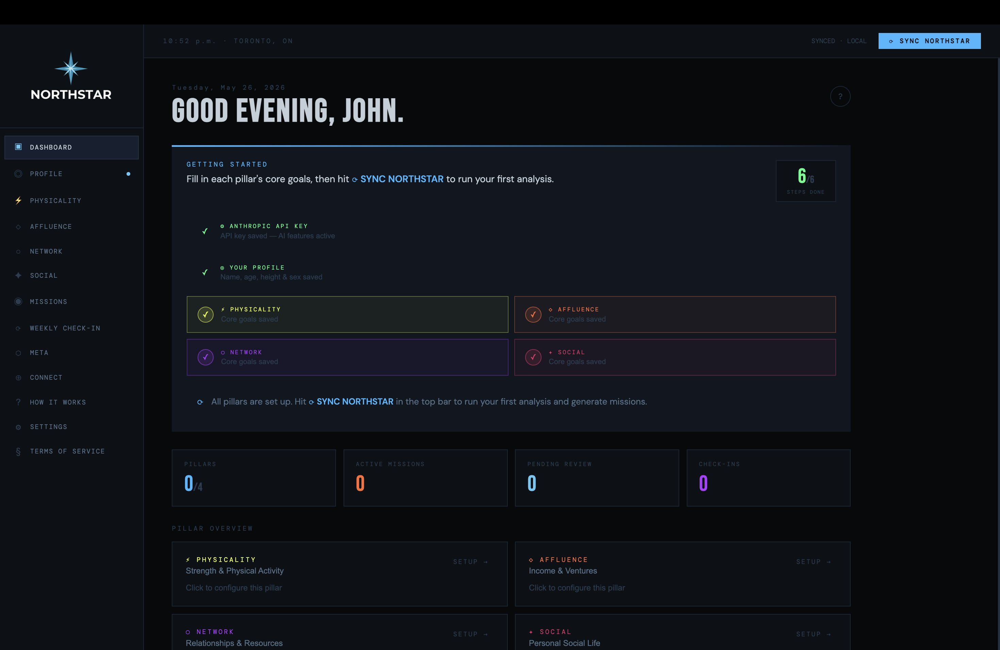

# northstar — Personal Development OS

A local-first personal development app built on Claude. All data stays on your machine.

---



## Repo structure

```
/
├── electron/          Electron main process — desktop app wrapper
├── northstar-frontend/     React app (Vite)
├── northstar-backend/      Express server — proxies Anthropic API, persists data
├── package.json       Root — Electron config, build scripts, concurrently
├── make-icons.sh      One-time icon converter (PNG → .icns)
└── .gitignore
```

---

## Prerequisites

- **Node.js** 18+
- **An Anthropic API key** — required for all Claude features

---

## API keys

Keys can be set two ways — you only need one:

**Option A — Settings UI (recommended)**
Launch the app, open **Settings**, and paste your keys directly. They are saved to `northstar-backend/data/config.json` and persist across restarts.

**Option B — `.env` file**
Create `northstar-backend/.env` and add:
```
ANTHROPIC_API_KEY=sk-ant-...
PORT=3001                    # optional, defaults to 3001
```

---

## Running in development

**All-in-one (recommended)**
From the repo root, this starts the frontend and backend concurrently:
```bash
npm install
npm run dev
```
Then open `http://localhost:5173` in your browser.

**Manual (two terminals)**
```bash
# Terminal 1 — backend
cd northstar-backend && npm install && npm run dev   # :3001

# Terminal 2 — frontend
cd northstar-frontend && npm install && npm run dev  # :5173
```

**With Electron (desktop window)**
Once the dev servers are running, open a third terminal:
```bash
npm run electron:dev
```
This opens northstar as a native desktop window loading from the dev servers.

---

## Packaging the Electron app

Use this workflow any time you want to build a distributable after making code changes.

**1. Install root dependencies** (first time only)
```bash
npm install
```

**2. Build the frontend**
```bash
npm run build
```
This runs `vite build` inside `northstar-frontend/` and outputs the bundled app to `northstar-frontend/dist/`.

**3. Package with Electron Builder**
```bash
npm run package
```
This bundles the Electron wrapper, the built frontend, and the backend into a distributable. Output lands in `dist/`:

| Platform | Output |
|----------|--------|
| macOS    | `dist/mac-universal/northstar.app` + `northstar-<version>.dmg` (universal binary — Apple Silicon + Intel) |
| Windows  | `dist/win-unpacked/` + `northstar Setup <version>.exe` |

**Shortcut — build + package in one step**
```bash
npm run package   # runs `npm run build` first, then electron-builder
```

**After making code changes**
Always rebuild the frontend before repackaging — the packaged app serves from the compiled `dist/` folder, not the dev server:
```bash
npm run build && npm run package
```

---

## How the packaged app works

In production mode the Electron main process (`electron/main.js`):
1. Spawns the Express backend from `resources/backend/server.js`
2. Polls `http://localhost:3001/api/health` until the backend is ready
3. Loads the frontend from the bundled `northstar-frontend/dist/index.html`

Data and config are stored in the OS user-data directory (set via `northstar_DATA_DIR`), not inside the app bundle, so they survive app updates.

---

## Data & backups

Your data lives at:
```
northstar-backend/data/northstar_data.json       # development
~/Library/Application Support/northstar/   # packaged macOS app
```

**Manual backup** — copy `northstar_data.json` anywhere.

**In-app backup** — the backend exposes `POST /api/backup`, which writes a timestamped copy to `data/backups/`. The frontend calls this automatically.

**Start fresh** — delete `northstar_data.json`. The backend recreates an empty state on next launch.

---

## What's kept private (never committed)

| Path | Why |
|------|-----|
| `northstar-backend/.env` | API keys |
| `northstar-backend/data/` | Your personal data and backups |
| `dist/` | Built binaries — regenerated by `npm run package` |
| `northstar-frontend/dist/` | Frontend build output |
| `*/node_modules/` | Dependencies |

---

## Testing

Unit tests cover the core pure-logic modules — no running backend or API keys required.

**Run all tests**
```bash
npm run test --prefix northstar-frontend   # 34 tests
npm run test --prefix northstar-backend    # 7 tests
```

**Watch mode** (re-runs on file save)
```bash
npm run test:watch --prefix northstar-frontend
npm run test:watch --prefix northstar-backend
```

**What's tested**

| Package | File | Covers |
|---------|------|--------|
| frontend | `__tests__/storage.test.js` | `pruneAndCompressLogs` — retention window, log compression |
| frontend | `__tests__/prompts.test.js` | `getLastSunday`, `getNextSunday`, `isSunday`, `checkinDoneThisWeek`, `buildInterviewQuestions` |
| frontend | `__tests__/sync.test.js` | `computeAlgorithmicScore` — deltas for completions and overdue missions, ±10 cap, 1–100 floor/ceiling |
| backend | `__tests__/config.test.js` | `readConfig` / `writeConfig` — missing file, merge, overwrite, return value |

The framework is [Vitest](https://vitest.dev/). Frontend tests run through the existing Vite config; backend tests use a standalone `vitest.config.js`.

---

## Backend API reference

The Express server runs on `:3001` and exposes:

| Method | Route | Purpose |
|--------|-------|---------|
| `GET` | `/api/health` | Health check — confirms backend is up and API key is set |
| `GET` | `/api/state` | Load full app state |
| `POST` | `/api/state` | Save full app state |
| `POST` | `/api/backup` | Create a timestamped data backup |
| `POST` | `/api/claude` | Claude API proxy (handles retries + overload) |
| `GET` | `/api/config` | Check which API keys are configured |
| `POST` | `/api/config` | Save API keys to `config.json` |
